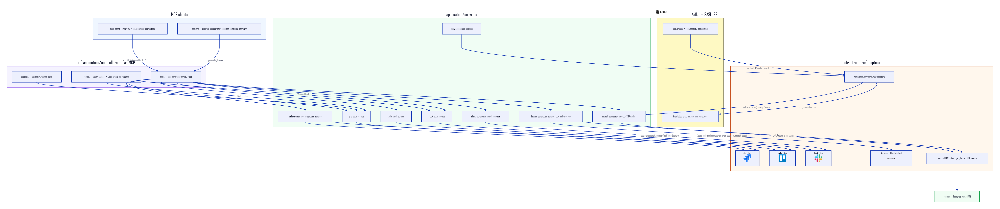

# mcp-server — Architecture

Part of **BrainTrust**. An [MCP](https://modelcontextprotocol.io) server, built on the official Python SDK's `FastMCP`, exposing Jira/Trello/Slack integrations and offboarding-dossier tools over streamable HTTP.

## Component diagram



> Source: [`architecture.d2`](architecture.d2) · Vector: [`architecture.svg`](architecture.svg)

### Regenerate the diagram

```bash
d2 --theme 0 --pad 40 architecture.d2 architecture.svg            # vector
d2 --theme 0 --pad 40 --scale 2 architecture.d2 architecture.png  # raster
```

> **Known issue:** as of d2 v0.7.1, PNG export needs Playwright's headless-browser driver, and the driver's default CDN currently 404s on the pinned version. Workaround: render the SVG above, then rasterize it directly (icons are embedded as base64 data URIs, no network access needed):
> ```bash
> npx -y @resvg/resvg-js-cli architecture.svg architecture.png
> ```

See [`../../../slack-agent/docs/architecture/`](../../../slack-agent/docs/architecture/) for the cross-repo system diagram this fits into.

## Two independent MCP clients, one server

- **slack-agent** connects during the guided interview for collaboration-tool and search tools (Jira/Trello task pulls, Slack workspace search).
- **backend** connects to call only `generate_dossier`, once per completed interview, from its Kafka consumer.

## The LLM call for dossier generation lives here, not in backend

`generate_dossier` (`DossierGenerationService`) runs **Claude (Anthropic SDK)** over a completed interview transcript, with `search_prior_dossiers`/`search_sops` available to the model as native tools for extra context, producing `{"summary": ..., "sections": [...]}` typed by `section_type` (`responsibilities`, `contacts`, `pending_tasks`, `knowledge_areas`). Keeping the model here means backend never needs an LLM SDK or API key, and the same generation capability is reusable by any MCP client.

## Hexagonal layers

Under `src/mcp_server/`:

- **`domain/`** — `collaboration_tasks/` (Jira/Trello task entities), `search/` (SOP search domain), `enums/`. Framework-agnostic.
- **`application/`** — `ports/`, `service_interfaces/`, `services/` — one per capability: `dossier_generation_service.py`, `collaboration_tool_integration_service.py`, `jira_auth_service.py`/`trello_auth_service.py`/`slack_auth_service.py`, `slack_workspace_search_service.py`, `search_connector_service.py` (SOP cache), `knowledge_graph_service.py`.
- **`infrastructure/controllers/`** — Primary adapters registered against `FastMCP`, split by MCP primitive:
  - `tools/` — one controller per MCP tool.
  - `prompts/` — guided multi-step prompts (`extract_pending_jira_tasks`, `jira_login`, `trello_login`, `slack_login`, `manage_search_connector`, ...).
  - `routes/` — raw HTTP routes for OAuth callbacks and Slack events.
  - All extend `base_controller.py`; `error_handler.py` centralizes MCP error responses.
- **`infrastructure/adapters/`** — concrete Jira/Trello/Slack/Anthropic/backend-API clients implementing the application ports.

## Three independent OAuth flows

Jira uses OAuth 2.0 (3LO), Trello uses OAuth 1.0a, Slack uses OAuth 2.0 user-token (search scopes). Callback endpoints in `routes/` normally handle completion automatically; the `complete_*` tools exist for manual/fallback completion. `search_slack_workspace` requires the Slack flow to have completed first (uses the Real-Time Search API, `assistant.search.context`).

## SOP search cache

`search_connector_service.py` maintains an in-memory SOP cache refreshed from backend every `MCP_SERVER_SOP_CACHE_TTL_SECONDS`. `test_search_query` queries it directly (used by slack-agent's question-suggestion feature); `refresh_search_index` forces an immediate refresh; `get_search_analytics`/`search_connector_status` expose cache hit/miss stats and backend reachability. A background Kafka consumer (`KafkaSopCacheConsumerAdapter`) also triggers `refresh_cache()` reactively whenever backend publishes `sop.created`/`sop.updated`/`sop.deleted` — the TTL poll remains as a backstop if Kafka is unavailable.

## Kafka

`mcp-server` both produces and consumes, matching backend's and slack-agent's SASL_SSL + SCRAM-SHA-512 transport:

- **Producer:** the `add_interaction` tool (`knowledge_graph_service.py`) publishes `knowledge_graph.interaction_registered`, consumed by backend's knowledge graph.
- **Consumer:** the reactive SOP-cache refresh above, subscribed to `{prefix}.sop.created/updated/deleted`.

Both share `infrastructure/config/settings.kafka_connection_kwargs()` — any new Kafka adapter here should go through that helper rather than constructing its own producer/consumer kwargs.

See `backend/docs/asyncapi/asyncapi.yml` for the canonical event contract.

## Related

- [`slack-agent/docs/architecture/`](../../../slack-agent/docs/architecture/) — cross-repo system diagram.
- [`backend/docs/architecture/`](../../../backend/docs/architecture/) — backend component diagram + doc.
- [`mcp-server/README.md`](../../README.md) — full tool/prompt tables, local dev, testing.
